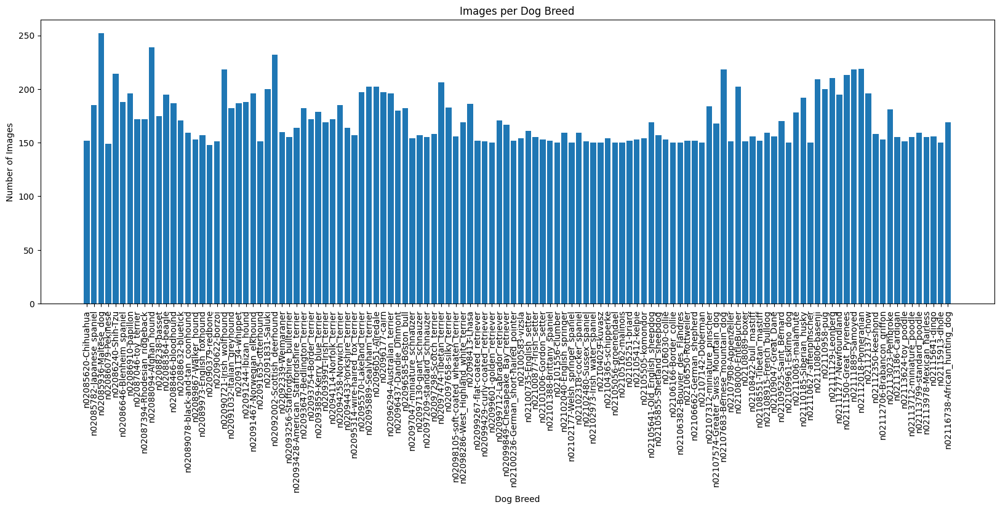
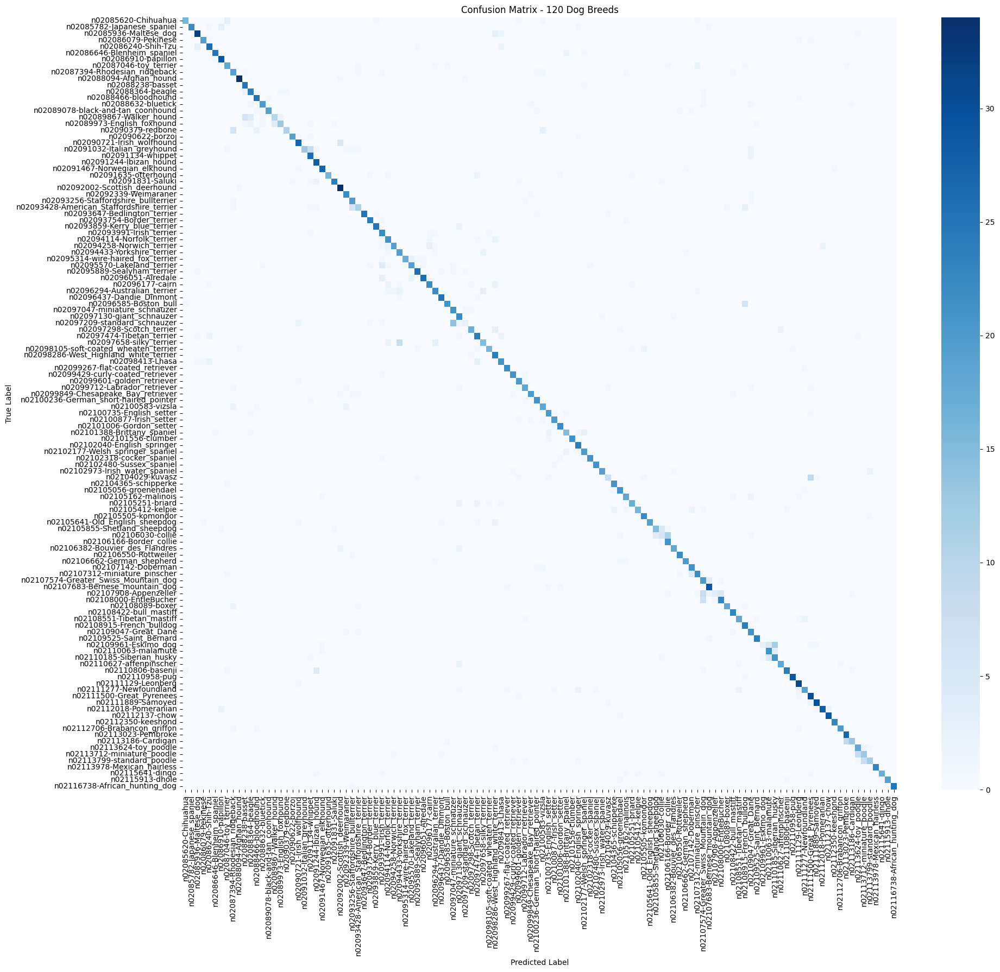
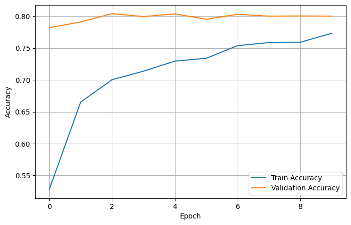
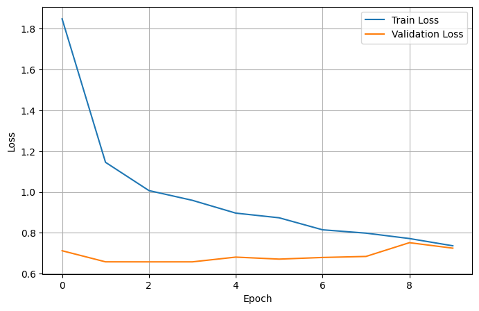

# 🐶 Dog Breed Classification — MobileNetV2 Transfer Learning

A deep learning image classifier that identifies a dog's breed from a photograph across **120 breeds**, built with transfer learning on a frozen **MobileNetV2** backbone (TensorFlow/Keras).


---

## 📌 Overview

This project trains a CNN to classify dog images into **120 fine-grained breeds** using transfer learning instead of training from scratch — a frozen ImageNet-pretrained MobileNetV2 backbone extracts features, while a small custom classification head is trained on top. The result is an accurate, lightweight model (~13 MB).

## 📊 Dataset

| | |
|---|---|
| Total images | 20,580 |
| Breeds (classes) | 120 |
| Images per breed | 148 – 252 (avg. 171.5) |
| Corrupted images | 0 |
| Split | 70% train / 15% validation / 15% test (stratified) |

## 🏗️ Model Architecture

- **Backbone:** MobileNetV2 (ImageNet pretrained, frozen — `trainable=False`)
- **Preprocessing:** `mobilenet_v2.preprocess_input`, applied inside the model via a `Lambda` layer
- **Augmentation:** Random horizontal flip, rotation (±10%), zoom (±10%) — training only
- **Head:** `GlobalAveragePooling2D → Dense(256, relu) → Dropout(0.3) → Dense(120, softmax)`
- **Input size:** 224×224×3
- **Optimizer / Loss:** Adam (lr=0.001) / Sparse Categorical Crossentropy
- **Callback:** `EarlyStopping(monitor="val_loss", patience=7, restore_best_weights=True)`

## 📈 Results

| Metric | Value |
|---|---|
| Test Accuracy | **80.24%** |
| Test Loss | 0.641 |
| Best Validation Accuracy | 80.40% (epoch 3) |
| Weighted-avg F1 (test) | 0.80 |
| Macro-avg F1 (test) | 0.79 |
| Model Size | ~13.3 MB |

Most misclassifications occur between closely related breed sub-types (e.g., standard vs. miniature schnauzer, collie vs. Border collie, Eskimo dog vs. Siberian husky) rather than unrelated breeds.

## 📂 Project Structure

```
.
├── 120-dog-breed-annotated.ipynb   # Full training notebook (EDA → training → evaluation)
├── 30_epoch_model.keras            # Trained model
├── assets/                         # Visuals (pulled from the notebook)
├── LICENSE
└── README.md
```

## 🖼️ Visuals

| Class Distribution | Confusion Matrix |
|---|---|
|  |  |

| Training Accuracy | Training Loss |
|---|---|
|  |  |

## 🚀 Getting Started

### 1. Clone the repo
```bash
git clone https://github.com/ENGABHAY/Dog-Breed-Classification-MobileNetV2.git
cd Dog-Breed-Classification-MobileNetV2
```

### 2. Explore the notebook
Open `120-dog-breed-annotated.ipynb` to see the full pipeline: data exploration, preprocessing, model architecture, training, and evaluation (confusion matrix, classification report, misclassification analysis).

### 3. Load the trained model
```python
import tensorflow as tf
from tensorflow.keras.applications.mobilenet_v2 import preprocess_input

model = tf.keras.models.load_model(
    "30_epoch_model.keras",
    custom_objects={"preprocess_input": preprocess_input},
    safe_mode=False,
)
```

## 🛠️ Tech Stack

TensorFlow / Keras · scikit-learn · Pandas · NumPy · Matplotlib · Seaborn · PIL

## 🔮 Future Improvements

- Fine-tune the top layers of MobileNetV2 (currently fully frozen) for a potential accuracy boost
- Address the specific confused breed pairs with targeted data/augmentation
- Test-time augmentation (TTA) for inference-time accuracy gains
- Compare against a larger backbone (e.g., EfficientNet) for the accuracy/size trade-off

## 👤 Author

**Abhay Kadam**
[GitHub](https://github.com/ENGABHAY) · [LinkedIn](https://linkedin.com/in/kadamabhay) · kadamabhay54@gmail.com

## 📄 License

This project is licensed under the MIT License.
